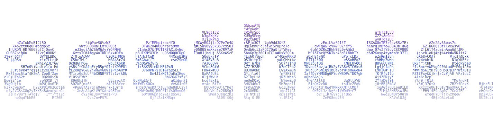
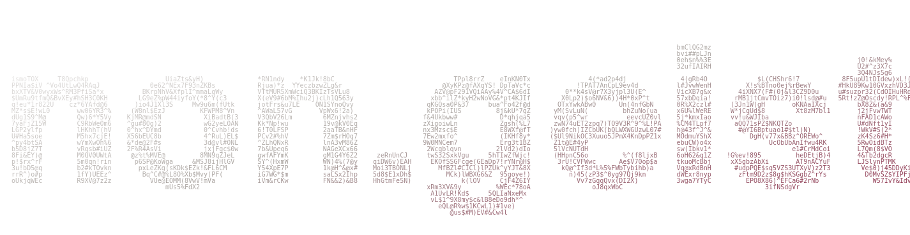
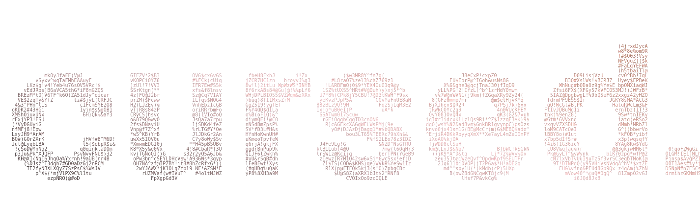

Hi! Iʼm Muhammed Tijani, alias contigen.
I started learning Web development in 2020, and I have worked with various libraries, frameworks and languages; done a lot of learning and relearning; read through the whole HTML & CSS MDN reference circa 2020/21, crazy right?

I get a kick from exploring and integrating Browser Web APIs that interact with the OS & hardware talk about Web Speech API, Contact Picker API and co. I aim to fully incorporate accessibility standards, micro-interactions, and whatnots into my work.

I'm obsesssed with typography.

### Now

I'm looking for a front-end/full-stack role with React/Next.js; if youʼre hiring or you know someone, kindly reach out on [X](https://x.com/_contigen), or send a mail to [contigenhq@gmail.com](mailto:contigenhq@gmail.com)

PS I maintain a package with 20k+ downloads: [non.geist](https://github.com/contigen/non.geist) and authored an [SVG VS Code extension](https://marketplace.visualstudio.com/items?itemName=contigen.svg-onselect)

PPS I think the Web is beautifully cursed 🙃

